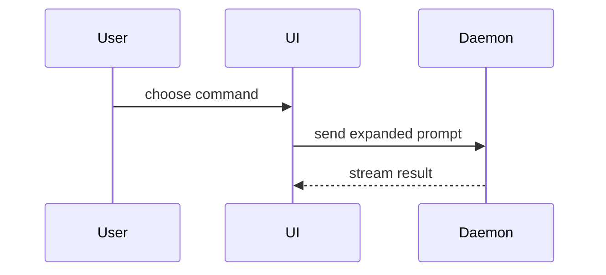

Help the user understand the current topic. Skip the preamble and keep prose brief. Pick the smallest view that makes the key point clear without making the underlying claim less true.

### Output Selection

- Infer the subject from the conversation and honor an explicitly requested format. With plain `show me`, choose the form that best explains the subject.
- Markdown in the reply is a complete output format for both chat and terminal surfaces. Use headings, emphasis, lists, and focused code blocks to explain outcomes, comparisons, and reasoning; add a diagram when relationships need one.
- `Show me markdown` requests a rendered Markdown reply. Create a Markdown file only when the user asks for a saved document or file artifact.
- `Show me html` requests a focused HTML file. Save file artifacts in the project or filesystem as appropriate and deliver them through the active environment's file-delivery mechanism; open locally when that is the requested surface.

### Surface Routing

- Infer whether the active surface is Telegram, a terminal, or another client. Keep the explanation portable and use surface-specific delivery only when the context or user request authorizes it.
- For Telegram output, read [`references/telegram-surfaces.md`](./references/telegram-surfaces.md) before selecting Markdown or HTML. Keep the immediate reply useful even when an attached artifact is the deeper view.
- When asked what changed or happened in current work, inspect the retained diff, status, and validation evidence when available. Separate this task from pre-existing changes and distinguish repository state from released or live behavior.

### Truth And State

- Label material claims as `live`, `released`, `locally implemented`, `proposed`, or `unverified` when the distinction affects interpretation. Omit redundant labels when the state is already unambiguous.
- Preserve the exact mechanism, owner, and boundary when simplifying technical behavior. A friendly label may supplement the implementation term but must not replace it when that would merge distinct timers, states, stages, or authorities.
- Make a visual diff correspond to the actual changed symbol or contract. Show unchanged neighboring behavior when omission could imply that it changed too.
- Do not infer that an affordance is clickable, interactive, rendered, or client-visible from source or markup shape alone. Distinguish designed or expected behavior from behavior verified through the relevant renderer, transport, runtime, and client.
- Treat a mockup, diagram, or rendered artifact as explanatory evidence, not runtime proof. State the unverified boundary when the user could reasonably mistake one for the other.

A compact state line is enough when provenance matters:

```text
State: locally implemented · validated · not released · not live
```

### Visual Forms

- Show logic or an algorithm as pseudocode:

```text
on(save)
  if content is unchanged
    return cached result
  write new content
  return fresh result
```

- Show runtime control flow as a call tree:

```text
submitForm
  createSession
    persistPrompt
    launchAgent
  navigateToSession
```

- Show UI structure as a component tree, including state and module boundaries that matter:

```tsx
<SessionPage> (apps/example/src/routes/session.tsx)
  useSessionEvents()
  <SessionToolbar>
    <RunSkillButton> (packages/ui)
```

- Show file responsibility or a broad refactor as a shallow file tree:

```text
src/
├─ commands/
│  └─ parses user actions
├─ sessions/
│  └─ owns session state
└─ transport/
   └─ sends API requests
```

- Show component interaction, control flow, or data flow with Mermaid:



- Use `diff` when the point is what changes and the surrounding shape already exists. Match the diff shape to the topic.

For a component change:

```diff
 <SessionPage>
   useSessionEvents()
   <SessionToolbar>
+    <RunSkillButton />
   <SessionTimeline>
+    <SkillResultCard />
```

For a file-layout change:

```diff
 src/
 ├─ commands/
+│  └─ show-me.ts
+│     └─ expands the slash command
 ├─ sessions/
-└─ transport.ts
+└─ transport/
+   ├─ client.ts
+   └─ stream.ts
```

For a call-tree or call-stack change:

```diff
 submitForm
   createSession
     persistPrompt
+    expandSkillMention
     launchAgent
-  navigateToSession
+  navigateToSession
+    subscribeToEvents
```

For a state or control-flow change:

```diff
 on(save)
-  write content
+  if content is unchanged
+    return cached result
+  write new content
+  invalidate cache
```

- Show the whole block when most of it is new, when omitted context would hide ownership or order, or when the user needs a copyable target shape:

```ts
function expandSkill(command: string): string {
  const skillName = command.slice(1)
  return `use the ${skillName} skill`
}
```

- For a visual UI, layout, state comparison, or concept too dense for Mermaid, use a focused HTML artifact — a diagram, an infographic, or a short slide deck, whichever fits the point. Match the product's colors, type, spacing, and components; use real labels and data; support desktop and mobile. When practical, render representative narrow and wide viewports and report what was actually inspected.

### Text Rendering

- Adapt the view to the available width in both terminal and chat surfaces. Use shallow trees with `├─`, `└─`, and `│`, a space before labels, and a three-column nesting step for file hierarchy; use indentation for call trees and pseudocode.
- Keep labels concise and in the user's language. Express status with words; use text glyphs with predictable monospace width for aligned diagram structure.
- For changes, use a compact fenced `diff` block in Telegram or the terminal. Show the changed lines and only the surrounding context needed to understand them.
- In trees, place comments and explanations as child nodes one level below the item they describe. Keep the item's own line for its label.
- Use prose lists for independent statuses and split larger views into meaningful sections.

### Guidance

Place each visual next to the short text it supports. Keep only the calls, files, props, states, and boundaries needed to answer the user's current question or the options to resolve the current discussion point. Prefer one primary visual and a few decision-relevant takeaways; add another form only when it explains a different necessary relationship.

Use source paths, symbol names, or validation evidence when they materially anchor a claim, not as decoration. Report the strongest state the evidence supports and no stronger.

You may use one of these, you may use several, it is unlikely you will use all of them. Use your judgement and don't overwhelm the user.
